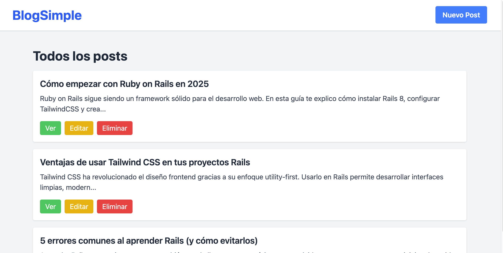

# Blog

**Blog** es una aplicación web desarrollada con [Ruby on Rails](https://rubyonrails.org/) **8.0.2** y [Tailwind CSS](https://tailwindcss.com/).  
Permite gestionar publicaciones (posts) mediante creación, edición y eliminación, con validaciones para asegurar calidad de los datos.  
Este proyecto forma parte de mi portafolio, demostrando habilidades en desarrollo web backend y frontend.

---

## 🚀 Tecnologías

- Ruby 3.x
- Ruby on Rails 8.0.2
- Tailwind CSS
- SQLite3 (en entorno de desarrollo)

---

## 📦 Gemfile destacado

```ruby
gem "rails", "~> 8.0.2"

---


## 📦 Screenshot de la app


